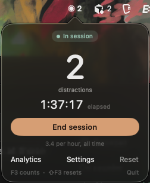
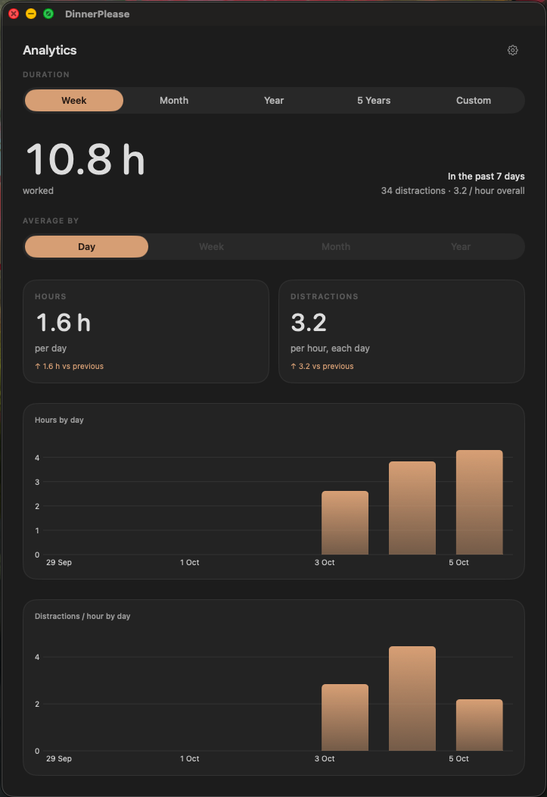

# DinnerPlease - Distractions counter | FlowState Practice

DinnerPlease helps you practice flow state. Hit a key when you get distracted. It counts those distractions and the hours you work. Analytics shows both over time, so you can see yourself getting better.

The name is from [Kung Fu Panda 4 (2024)](https://youtu.be/c4dVfBNQtmc?si=evN03ywYiywtfgAU&t=8). Po sits down to focus: "inner peace, inner peace... dinner please."

## Screens





## Works on

Apple silicon Mac, macOS 14 or later.

## Before you install

- Xcode Command Line Tools, so the Mac can compile the app: `xcode-select --install`
- [Karabiner-Elements](https://karabiner-elements.pqrs.org/). macOS uses F3 for Mission Control. Karabiner lets a plain F3 press reach DinnerPlease instead. The default keys are F3 to count and Shift+F3 to reset.

## Install

From a clone of this repo:

```bash
./build.sh
```

The script builds the app, installs it to `~/Applications/F3Counter.app`, and opens it. It sits in the menu bar.

On first launch it turns on open-at-login. If macOS asks, allow it under System Settings → General → Login Items.

## Use

- F3 counts one distraction. A small number flashes and fades.
- Shift+F3 resets the count.
- Click the menu bar icon to start or end a session. Ending a session saves the distractions and the time.
- Analytics is the hours you worked and how often you got distracted. Pick a range and watch the rate drop.
